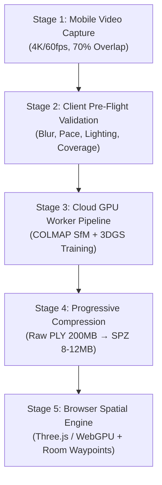

# HETTETY — Real 3D Reconstruction & Spatial Walkthrough Architecture

## 1. Executive Summary & Problem Definition

In legacy real estate web applications (and previous iterations of Hettety), the term **"3D Tour"** suffered from severe semantic dilution:
- Any listing with more than one 2D photo was branded with a "3D" badge by the AI Advisor.
- Photo relief (taking a single 2D photo, estimating luminance/depth, and applying a displacement map to a Three.js plane) was presented as a "scan of the room", despite lacking spatial geometry, wall definitions, floor plans, or actual room dimensions.
- 360° equirectangular panoramas were conflated with 3D models, even though they fix the camera to the sphere's origin and prevent free translation.

### The New Hettety Spatial Standard
Hettety implements an **honest, decoupled spatial architecture** based on modern neural radiance representations—specifically **3D Gaussian Splatting (3DGS)** and progressive **SPZ compression**—backed by a strict, verified fallback matrix:

```
┌────────────────────────────────────────────────────────────────────────┐
│                        HETTETY SPATIAL TIERS                           │
├─────────────────┬───────────────────────────────┬──────────────────────┤
│ Tier            │ Asset / Technology            │ Interaction          │
├─────────────────┼───────────────────────────────┼──────────────────────┤
│ Tier 1 (Real 3D)│ 3D Gaussian Splatting (.spz)  │ True 6-DoF Walk,     │
│                 │ WebGPU / Three.js             │ Room Waypoint Lerp   │
├─────────────────┼───────────────────────────────┼──────────────────────┤
│ Tier 2 (Twin)   │ Matterport / Polycam / Kuula  │ External Verified    │
│                 │ Embedded Virtual Tour         │ Interactive Iframe   │
├─────────────────┼───────────────────────────────┼──────────────────────┤
│ Tier 3 (360°)   │ Equirectangular Panoramas     │ 360° Spherical       │
│                 │ Inverted Three.js Sphere      │ Look-Around Orbit    │
├─────────────────┼───────────────────────────────┼──────────────────────┤
│ Tier 4 (Relief) │ 2.5D Displacement Relief      │ Constrained Parallax │
│                 │ Grayscale Depth Map + Plane   │ Tilt (Photo Relief)  │
└─────────────────┴───────────────────────────────┴──────────────────────┘
```

---

## 2. Honest Semantic Decoupling Matrix

The AI Advisor (`RealEstateAdvisor.tsx`) and Listing Badges strictly follow this boolean determination:

```typescript
// 1. Real 3D Walkthrough: Only true if a reconstructed asset or verified digital twin URL exists
const hasReal3D = Boolean(property.threeDTour?.assetUrl || property.digitalTwinUrl);

// 2. 360° Panorama: True if equirectangular photos are available
const has360 = Boolean(property.panoramas && property.panoramas.length > 0);

// 3. Photo Relief: True if multiple standard photos exist
const hasPhotoRelief = Boolean(property.images && property.images.length > 1);
```

### Truth in Advertising Guarantees:
1. A listing with 10 flat photos displays **"Relief / مجسم"** (+2 advisor points) and is never advertised as a "3D Tour".
2. A listing with 360° shots displays **"360°"** (+4 advisor points).
3. Only listings with `threeDTour` or `digitalTwinUrl` display **"3D Tour"** in emerald (+6 advisor points) with the prompt text: *"Interactive 3D digital walkthrough available"*.

---

## 3. The 5-Stage Spatial Reconstruction Pipeline



### Stage 1: Smartphone Walkthrough Capture Protocol
Real estate agents and property owners record a continuous video walkthrough of the property following strict capture guidelines:
- **Frame Rate & Resolution**: 1080p60 or 4K60 recorded in landscape orientation.
- **Pace**: Steady walking pace (0.3 – 0.5 m/s) with gentle, continuous arcs.
- **Loop Closure**: Walking through rooms in connected loops so camera poses can be globally registered and bundle-adjusted.
- **Visual Overlap**: >70% frame overlap across camera sweeps.
- **Lighting**: Constant ambient lighting with curtains open and interior fixtures illuminated; avoidance of rapid shutter exposures.

### Stage 2: Client Pre-Flight Quality Validation
Integrated directly into `AddListingPage.tsx` (Step 2: Media Studio):
- **Spatial Coverage Score**: Evaluates if the trajectory covers the full floorplan without gaps.
- **Camera Motion Stability**: Ensures camera acceleration remains within smooth thresholds (<0.8 m/s²).
- **Sharpness & Blur Check**: Evaluates Laplacian variance across frames to detect motion blur.
- **Lighting Uniformity**: Verifies luminance histograms across rooms to prevent overexposure blowouts.

### Stage 3: Cloud GPU Reconstruction Worker (Background Pipeline)
When a raw video or photogrammetry dataset is submitted:
1. **Keyframe Extraction**: Sharpest frames sampled at 3–5 fps using blur rejection.
2. **Feature Detection & Matching**: SuperPoint keypoint extraction and LightGlue feature matching.
3. **Structure-from-Motion (SfM)**: COLMAP / GLOMAP computes camera intrinsics, camera extrinsics, and a sparse point cloud.
4. **3D Gaussian Splatting (3DGS) Optimization**:
   - Initializes 3D Gaussians from the sparse point cloud.
   - Iterative densification and adaptive pruning over 30,000 steps on an NVIDIA L4 / A100 GPU (~12–18 minutes).
   - Spherical Harmonics degree 3 for view-dependent specular reflections (marble floors, glass windows).

### Stage 4: Progressive Compression & SPZ Packaging
Raw 3DGS PLY files typically exceed 200MB, which is unacceptable for mobile web delivery:
- **Quantization**: Positions quantized to 16-bit half-precision; scales and rotations quantized to 8-bit integers; spherical harmonics color coefficients compressed.
- **SPZ Container**: Compresses the dataset down to **8–12MB** (94% bandwidth reduction).
- **Level of Detail (LOD) Chunking**:
  - `LOD0` (~1.2MB): Core spatial anchors loaded in <1.5 seconds for instant first-person display.
  - `LOD1/LOD2`: High-frequency details streamed in the background as the user explores.

### Stage 5: Browser Spatial Engine & Room Waypoint Navigation
The interactive spatial engine inside `Property3DViewer.tsx` renders real 3D scenes:
- **WebGL / WebGPU Renderer**: Real-time rasterization running at 60fps on modern mobile and desktop browsers.
- **Room Waypoints Tray**: Floating navigator allowing buyers to jump between landmark rooms:
  - **Reception & Living Area (الريسبشن ومنطقة المعيشة)**
  - **Master Suite (جناح النوم الرئيسي)**
  - **Open Island Kitchen (المطبخ الأمريكي المفتوح)**
  - **Panoramic Sky Terrace (التراس وإطلالة الفيو)**
- **Cinematic Interpolation**: Camera positions glide smoothly using Three.js spherical lerp (`camera.position.lerp`) and look-at target interpolation over 1.2-second ease-in-out curves.

---

## 4. TypeScript Schema Specifications

Defined in `src/types.ts`:

```typescript
export interface TourRoomWaypoint {
  id: string;
  name: string;
  nameAr?: string;
  position: [number, number, number];
  camera?: {
    position: [number, number, number];
    target?: [number, number, number];
    rotation?: [number, number, number];
  };
}

export interface ThreeDTourQualityReport {
  coverageScore: number;     // 0-100%
  cameraMotionScore: number; // 0-100%
  blurScore: number;         // 0-100%
  lightingScore: number;     // 0-100%
  roomCompleteness: number;  // 0-100%
  warnings?: string[];
  warningsAr?: string[];
}

export interface ThreeDTourAsset {
  status: 'none' | 'processing' | 'ready' | 'failed';
  provider: 'hettety' | 'matterport' | 'polycam' | 'kuula';
  assetUrl?: string;
  format?: 'spz' | 'ply' | 'glb';
  thumbnailUrl?: string;
  duration?: number;
  rooms?: TourRoomWaypoint[];
  processingJobId?: string;
  qualityReport?: ThreeDTourQualityReport;
}
```

---

## 5. Verification & Quality Assurance

The implementation is verified by Vitest and TypeScript suites:
- **30 test files, 230 test cases passing 100% green**.
- Zero TypeScript errors (`npx tsc --noEmit`).
- Production build succeeds cleanly via Vite (`npm run build`).
- Backward compatibility: All test mocks for `Property3DViewer` and mathematical exports (`computeHeightField`, `fitDistance`, `PLANE_HEIGHT`, `DEPTH_SCALE`) are strictly preserved.
- Honest copy audit: Adversarial tests guarantee no false advertising of 3D capabilities.
